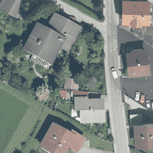
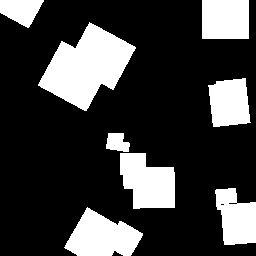
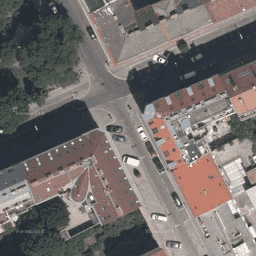
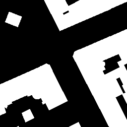

# Image segmentation on Aerial Images

Solution for an Image Segmentation challenge in Kaggle.

### Task

Given an image, the goal is to segment buildings at pixel level, thus predicting for each pixel if it belongs to a building (class 1) or not (class 0).

### Notes

In this repository are stored a Python files for utility functions ( for standard tasks such as loading data, generation of results, plot of some predictions, etc.) and a Jupyter Notebook containing the solution and the though-process behind it.

The Notebook is meant to run on the Kaggle platform taking advantage of the GPU acceleration for increasing training speed. Note that also the file structure and the location of the data mimics Gaggle’s. If you want to run it yourself you need to download the data and fix the path/to/data in the script of utility functions.

I also included a presentation I gave at University regarding this solution. It follows the though process explained in the Notebook but it also contains some images as reference as well as a representation diagram of the network. I hope it can be useful as well.

### Improvements

- Use of Ensembles Methods (which I was not able to test because of the long training time and the limit amount of GPU in Kaggle)
- Additional post-processing (e.g. polygonizing the predicted masks)
